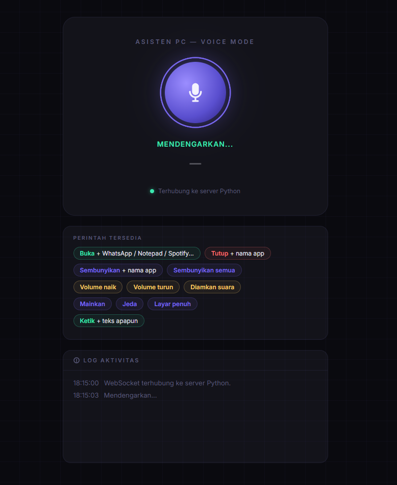

# Asisten PC Windows

Asisten PC Windows adalah aplikasi navigasi dan perintah suara untuk PC Windows. Aplikasi ini memungkinkan pengguna menjalankan perintah seperti membuka aplikasi, menutup aplikasi, menyembunyikan jendela, mengatur volume, menjalankan media, masuk layar penuh, dan mengetik teks hanya dengan suara.

Proyek ini dibuat sebagai asisten sederhana yang berjalan lokal di komputer. Suara pengguna dikenali, lalu Python mengeksekusi perintah native Windows sesuai teks yang diterima.

## Tampilan Sampel



## Fitur Utama

- Membuka aplikasi, misalnya `buka chrome`, `buka notepad`, `buka whatsapp`.
- Menutup aplikasi, misalnya `tutup chrome`.
- Menyembunyikan jendela aplikasi atau semua jendela.
- Mengatur volume: naik, turun, mute.
- Mengontrol media: play atau pause.
- Mode layar penuh.
- Mengetik teks ke field aktif dengan perintah suara.
- Mendukung Bahasa Indonesia melalui pengenalan suara.

## Pilihan Cara Menjalankan

Di repository ini ada 3 pendekatan teknis:

1. **Via terminal**  
   Menggunakan `buka_apps.py`. Mode ini sederhana dan langsung dari terminal. Cocok untuk pengujian awal, tetapi fiturnya lebih terbatas.

2. **Via UI desktop**  
   Menggunakan `gui_asisten.py`. Mode ini memakai tampilan desktop berbasis `customtkinter` dan memproses suara langsung dari Python.

3. **Via browser + server Python**  
   Menggunakan `server_asisten.py` dan `asisten.html`. Ini adalah mode yang direkomendasikan.

## Kenapa Mode Browser Direkomendasikan?

Mode utama proyek ini adalah `server_asisten.py`.

Alurnya:

1. Python menjalankan WebSocket server lokal.
2. Python juga menjalankan HTTP server lokal untuk membuka `asisten.html`.
3. Google Chrome membuka halaman asisten sebagai interface suara.
4. Chrome menangkap suara menggunakan Web Speech API.
5. Teks hasil pengenalan suara dikirim ke Python.
6. Python mengeksekusi perintah di Windows.

Alasan memilih pendekatan ini adalah karena kita mengambil jalan pintas yang praktis: Google Chrome sudah punya mekanisme pengenalan suara dan noise cancellation yang sangat baik. Daripada membangun filter suara dan noise cancellation sendiri sepenuhnya di Python, Chrome dipakai sebagai "telinga" aplikasi, sementara Python fokus sebagai eksekutor perintah Windows.

Dengan pendekatan ini, hasil deteksi suara biasanya lebih stabil, terutama di kondisi mikrofon atau ruangan yang tidak ideal.

## Kebutuhan Sistem

- Windows 10 atau Windows 11.
- Google Chrome disarankan.
- Python 3.10 atau lebih baru.
- Mikrofon aktif dan sudah diberi izin akses.
- Koneksi internet untuk fitur pengenalan suara Chrome/Google.

## Instalasi Python

Jika Python belum terpasang:

1. Download Python dari [python.org](https://www.python.org/downloads/).
2. Saat instalasi, centang opsi **Add python.exe to PATH**.
3. Setelah selesai, buka PowerShell atau Command Prompt.
4. Cek instalasi:

```powershell
python --version
```

Jika perintah `python` tidak dikenali, coba:

```powershell
py --version
```

## Instalasi Dependency

Masuk ke folder project:

```powershell
cd "Direktori"
```

Install dependency utama untuk mode browser:

```powershell
pip install websockets pygetwindow pyperclip AppOpener
```

Jika `pip` tidak dikenali, gunakan:

```powershell
python -m pip install websockets pygetwindow pyperclip AppOpener
```

Untuk menjalankan mode UI atau terminal Python murni, dependency tambahan yang mungkin dibutuhkan:

```powershell
pip install SpeechRecognition PyAudio customtkinter
```

Catatan: instalasi `PyAudio` kadang berbeda antar perangkat Windows. Jika gagal, pastikan Python dan pip sudah versi terbaru.

## Cara Menjalankan Mode Utama

Jalankan server asisten:

```powershell
python server_asisten.py
```

Atau:

```powershell
py server_asisten.py
```

Setelah dijalankan:

1. Terminal akan menyalakan server lokal.
2. Chrome akan terbuka otomatis ke halaman asisten.
3. Izinkan akses mikrofon jika diminta.
4. Klik/tap tombol mikrofon pada halaman asisten.
5. Ucapkan perintah.

Alamat lokal yang digunakan:

- WebSocket: `ws://localhost:8765`
- Halaman asisten: `http://localhost:8766/asisten.html`

## Contoh Perintah Suara

```text
buka chrome
buka notepad
buka youtube
tutup chrome
sembunyikan chrome
sembunyikan semua
volume naik
volume turun
diamkan suara
mainkan
jeda
layar penuh
ketik halo ini percobaan
```

## Cara Simpel: Buat File BAT

Kalau ingin menjalankan aplikasi cukup dengan double-click, buat file baru misalnya:

```text
jalankan_asisten.bat
```

Isi file tersebut:

```bat
@echo off
cd /d "Direktori"
python server_asisten.py
pause
```

Jika di komputer kamu perintah yang aktif adalah `py`, gunakan versi ini:

```bat
@echo off
cd /d "Direktori"
py server_asisten.py
pause
```

Setelah itu cukup double-click file `.bat` tersebut untuk membuka Asisten PC.

## Menjalankan Mode Lain

Mode terminal:

```powershell
python buka_apps.py
```

Mode UI desktop:

```powershell
python gui_asisten.py
```

Mode browser tetap disarankan karena lebih praktis dan memanfaatkan kemampuan speech recognition serta noise cancellation dari Chrome.

## Struktur File

```text
.
+-- asisten.html        # Tampilan browser dan input suara via Chrome
+-- server_asisten.py   # Server utama: menerima teks dan menjalankan perintah Windows
+-- gui_asisten.py      # Alternatif mode UI desktop
+-- buka_apps.py        # Alternatif mode terminal sederhana
+-- Sampel.png          # Gambar sampel untuk README
```

## Catatan

- Aplikasi ini berjalan lokal di Windows.
- Beberapa perintah bergantung pada nama aplikasi dan proses Windows.
- Untuk hasil terbaik, gunakan Chrome dan beri izin akses mikrofon.
- Jika aplikasi tertentu tidak terbuka, pastikan aplikasinya sudah terinstall dan namanya dikenali oleh Windows atau `AppOpener`.
